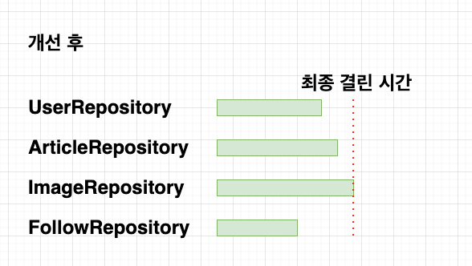

# 간단하게 CompleteFuture로 속도 개선하기

일반적으로 jpa로 DB로 여러 테이블 조회후, 결과값을 내보내야 하는 로직있다.  
하면, 밑에와 같이 4초 정도의 시간이 걸린다.


이보다 조금 더 빠르게 할 방법도 있을까?  
각 로직마다 걸리는 시간이 있을것인데, 이것만큼 시간이 걸린다면 빠르다라고 생각할 수 있을것이다.  

```java
import java.util.concurrent.CompletableFuture;

CompletableFuture.allOf(imageFuture, articlesFuture, followCountFuture)
                .thenAcceptAsync(v -> {
                    log.info("Three futures are completed.");
                })
                .thenRunAsync(() -> {
                    log.info("Three futures are also completed.");
                })
                .thenApply(v -> {
                    try {
                        var image = imageFuture.get();
                        var articles = articlesFuture.get();
                        var followCount = followCountFuture.get();

                        return Optional.of(
                                new User(
                                        userEntity.getId(),
                                        userEntity.getName(),
                                        userEntity.getAge(),
                                        image,
                                        articles,
                                        followCount
                                ));
                    } catch (Exception e) {
                        throw new RuntimeException(e);
                    }
                });
```



여러종류의 값을 한번에 조회하니, 로직의 최대로 걸리는 시간만큼 시간이 걸린다.  

